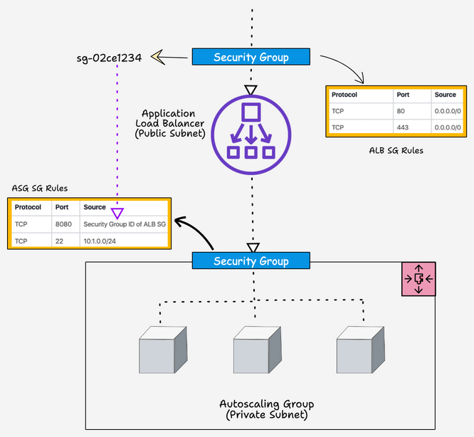

## Deployment of ALB with an ASG using Terraform

This project explains the automated deployment process of an Application Load Balancer (ALB) with an Auto-scaling Group (ASG) using `Terrform`:
- AWS Autoscaling group spanning three subnets.
- IAM role attached to Autoscaling instances to access other AWS services
- Application Load Balancer attached to the Autoscaling group

## Prerequisites

- The latest Terraform binary is installed and configured in your system.
- `AWS CLI` is installed and configured with a valid AWS account with permission to deploy the autoscaling group and application load balancer.
- If you are using an ec2 instance to run Terraform, ensure you attach an IAM role with permission to create ASG and ALB.

## Setup Architecture & Overview


Here is the high-level overview of the AWS resources and components created by this setup.

- IAM role with required policies and the role is attached to an `IAM instance profile` which will be then attached to every instance that is part of the autoscaling group.
- The auto-scaling group manages a specified number of instances and uses the `launch template` with the required configurations to launch an instance.
- Application load balancers send traffic to the ASG instances. It creates a target group and creates an `LB listener` that listens to port `80` for `HTTP` traffic and forwards it to the `specified target group`(ASG) to distribute traffic.
- Health checks are added to instances in the target group to check the status of the instance. If the instance health check fails, it destroys the instance and launches a new instance. Once the new instance is in a healthy state, the application load balancer will then forward the traffic to the newly launched instance.
- We have separate security groups for ALB and ASG EC2 instances. For ASG, traffic on port `8080` will be accepted only from the ALB. We achieve this by adding the security group ID of the ALB as the source traffic for the ASG security group. Also, we allow port `22` access only from a specific subnet.

Here is a high-level view of how ALB and ASG security groups are designed.



## Terraform AWS ALB and ASG Provisioning Workflow


The ALB and ASG terraform script is structured in the following way.

```sh
├── apps
│   ├── alb-asg
│   │   ├── main.tf
│   │   ├── outputs.tf
│   │   └── variables.tf
├── infra
│   └── iam-policies
│       └── alb-asg.json
├── modules
│   ├── asg
│   │   ├── main.tf
│   │   ├── outputs.tf
│   │   └── variables.tf
│   ├── iam-policy
│   │   ├── main.tf
│   │   ├── outputs.tf
│   │   └── variables.tf
│   ├── alb
│   │   ├── main.tf
│   │   ├── outputs.tf
│   │   └── variables.tf
│   └── security-group
│       ├── main.tf
│       ├── outputs.tf
│       └── variables.tf
└── vars
    └── dev
        └── alb-asg.tfvars
```

- `vars` folder contains the variables file named `alb-asg.tfvars`

- `appsalb-asg` folder contains the parent terraform module `(main.tf)` that calls the child modules under the modules folder

- `infra/iam-policies` contains the IAM JSON policy document named alb-asg.json that will be added to the Instance Profile.

- The child modules contain the following resources

- ***IAM Role:*** For ec2 instance in the autoscaling group to access other AWS services.
- ***Security Group:*** To allow & deny access to/from the load balancer and ec2 instance.
- ***Load Balancer:*** It distributes incoming traffic to EC2 instances using the Round Robin algorithm.
- Target Group: To evenly distribute traffic throughout a collection of EC2 instances.
- ***Listener:*** It monitors incoming requests on a certain port and notifies the target group.
- ***Auto Scaling Group:*** It automatically scales EC2 instances based on demand, which maintains application availability and also keeps track of instance health, and replaces failing instances.
- ***Launch Template:*** A template that contains the AMI details, keypair, etc. This template will be applied to the autoscaling group instances.